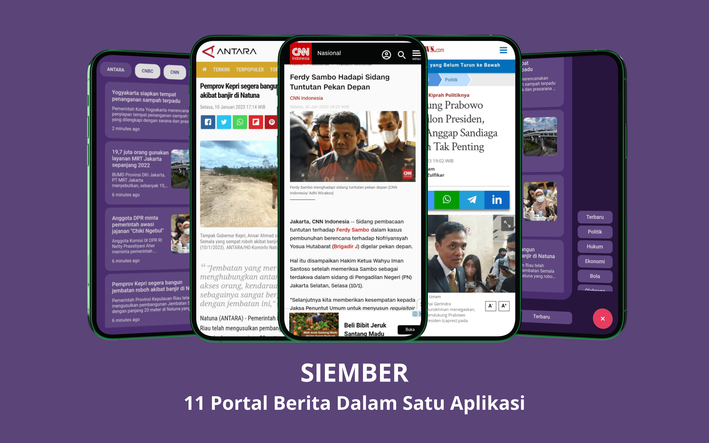

# SiEmber

SiEmber adalah aplikasi baca berita yang menampilkan 11 berita dalam satu aplikasi, aplikasi ini dirancang menggunakan dart (Flutter) dengan menggunakan state management GetX.

### API
- https://api-berita-indonesia.vercel.app/

### Download SiEmber

https://drive.google.com/file/d/1Asj8UaOu1xZDj1xbnL0DjYu3V7smZuaN/view


## Preview


## Installation Flutter


1. Clone the repo

   ```bash
   git clone https://github.com/jarrfajar/Quran
   ```
2. Install packages

   ```dart
   flutter pub get
   ```